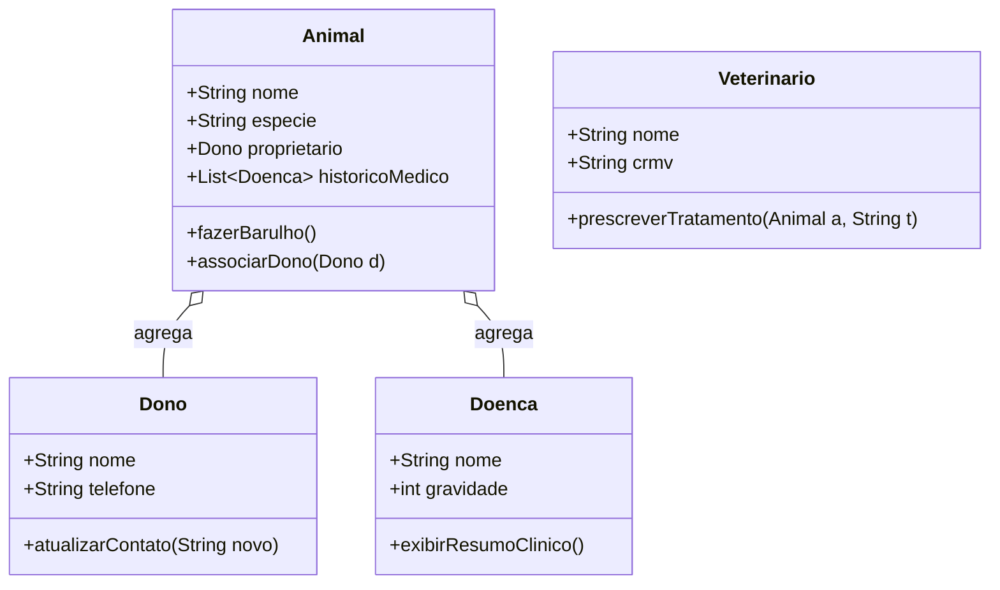

# PetShop-Management-System---Aggregation-Exercise

## Diagrama de Classe / Class Diagram

Descrição

    Este repositório contém uma implementação prática de Agregação em Java, utilizando o contexto de um PetShop. O objetivo é demonstrar como objetos independentes (Dono, Doença, Veterinário)
    podem ser associados a um objeto principal (Animal) sem que a existência das partes dependa obrigatoriamente do todo.

Entidades e Agregações

    Animal: Entidade central que agrega um Dono e uma lista de Doenca.
    Dono: Representa o proprietário, que pode existir no sistema mesmo sem um animal vinculado.
    Veterinario: Profissional responsável pelos atendimentos e prescrições.
    Doenca: Catálogo clínico agregado ao histórico do animal conforme diagnósticos.

----------------------------------------------------------------------------------------------------------------------------------------------------

Description

    This repository contains a practical implementation of Aggregation in Java, using a PetShop context. The goal is to demonstrate how independent objects (Owner, Disease, Veterinarian)
    can be associated with a main object (Animal) without the parts' existence being strictly dependent on the whole.

Entities and Aggregations

    Animal: The central entity that aggregates an Owner and a list of Diseases.
    Owner (Dono): Represents the proprietor, who can exist in the system independently.
    Veterinarian (Veterinário): Professional responsible for consultations and prescriptions.
    Disease (Doença): Clinical catalog aggregated to the animal's history based on diagnoses.

graph TD
    subgraph STACK [Stack]
        v_animal1[animal1]
        v_dono1[dono1]
    end

    subgraph HEAP [Heap]
        obj_animal1[<b>Animal Object</b> Name: Rex Owner_Ref: @0x100]
        obj_dono1[<b>Owner Object @0x100</b> Name: Carlos]
    end

    v_animal1 --> obj_animal1
    v_dono1 --> obj_dono1
    obj_animal1 -.->|Aggregates| obj_dono1

